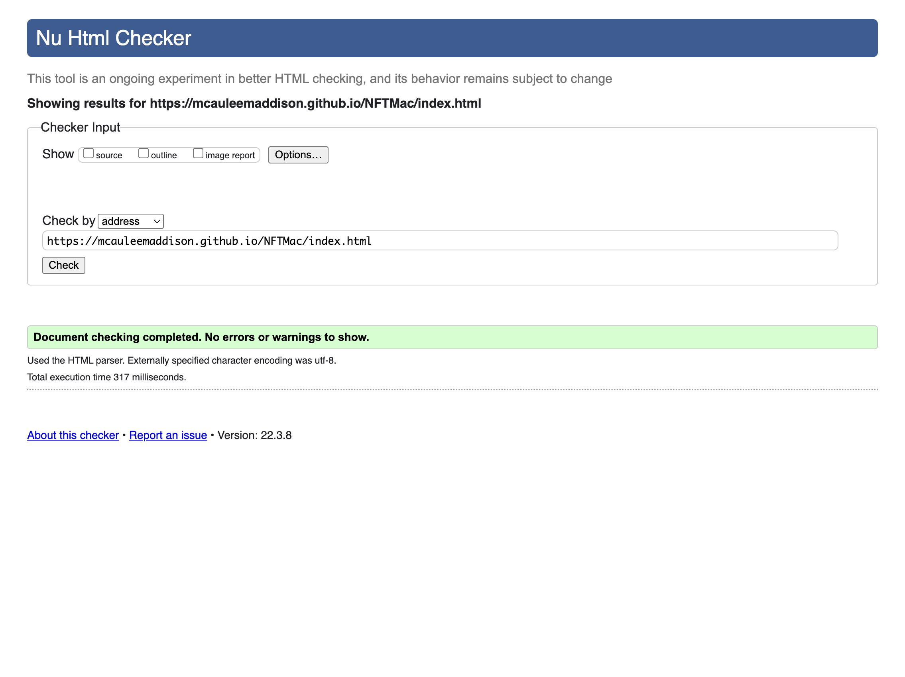
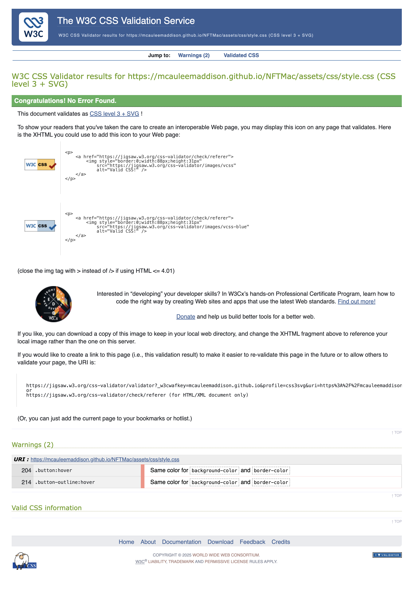
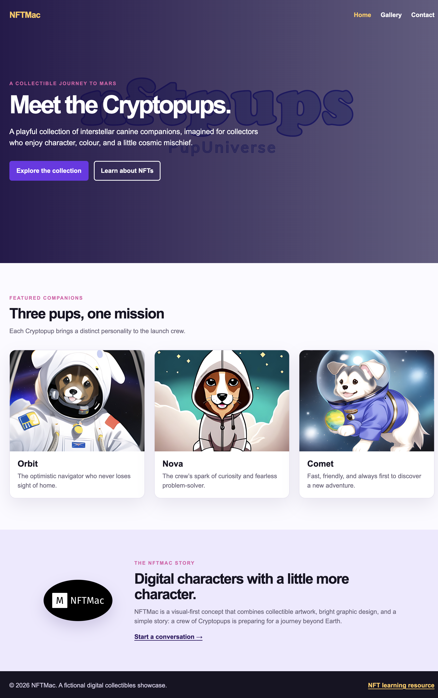
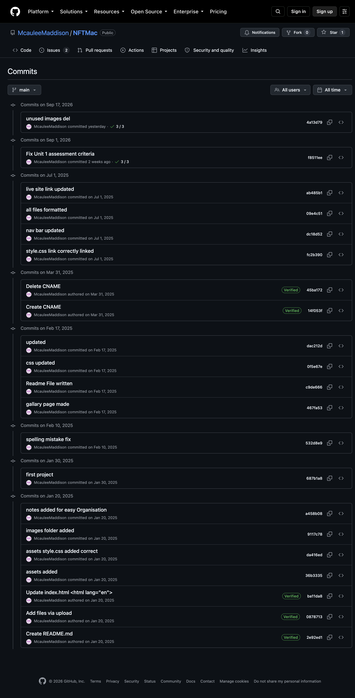

# NFTMac | The Cryptopups’ journey to Mars

[View the live site](https://mcauleemaddison.github.io/NFTMac/)

NFTMac is a responsive, visual-first showcase for the fictional Cryptopups digital collectible series. It combines a cinematic introduction, character gallery, and contact route in a small, accessible static site.

## User stories and finished screens

### Discover the collection

As a visitor, I can quickly understand the Cryptopups concept and move directly to the collection.


### Explore the characters

As a collector, I can browse a clear gallery of Cryptopups and identify each featured character.


### Start a conversation

As a potential collaborator, I can find contact details and use a labelled contact form to prepare an email message.


## Structure

All static assets are grouped by file type under `assets/`:

```text
assets/
├── css/
│   └── style.css
├── images/
│   ├── cryptopups/
│   └── screenshots/
└── video/
    └── nftmac-hero.mp4
```

All website images, including the finished-product screenshots, are consolidated within `assets/images/`.

## Quality checks

- Each page uses semantic HTML5 landmarks, a skip link, descriptive image alternative text, labelled form fields, and responsive layouts.
- The HTML pages pass the official W3C Nu HTML Checker without errors.
- The custom stylesheet passes the W3C CSS Validator without errors.
- Every external website link uses `target="_blank"` and `rel="noopener noreferrer"` so it opens safely in a separate tab.
- Homepage, gallery, navigation, and contact-form layouts were checked at desktop and mobile widths.

### W3C Nu HTML Checker result



### W3C CSS Validator result



### Lighthouse result

The Lighthouse / PageSpeed Insights audit link is configured for the deployed site and covers the Performance, Accessibility, and Best Practices categories. Open the report here for the assessor to review: [open the Lighthouse audit](https://pagespeed.web.dev/analysis?url=https%3A%2F%2Fmcauleemaddison.github.io%2FNFTMac%2F).

## Known issues / bugs fixed

- Fixed the stylesheet link so every page loads `assets/css/style.css` consistently.
- Fixed the navigation and active-page states so users can move between Home, Gallery, and Contact without losing orientation.
- Removed 20 unused `assets/images/nft*.jpeg` files to keep the repository focused on the `cryptopups` collection assets.

## Design

The wireframe/mockup captures the intended visual hierarchy: a cinematic home-page introduction, a focused collection grid, and a simple contact route. The dark space-inspired base keeps the colourful Cryptopups artwork prominent, while bright accent colours add energy and make calls to action easy to spot. The consistent top navigation was chosen so the three main routes stay predictable on desktop and mobile.




## Commit history



## Technologies

- HTML5
- CSS3
- Git and GitHub Pages

## Deployment

The site is deployed from the `main` branch through GitHub Pages:

https://mcauleemaddison.github.io/NFTMac/
