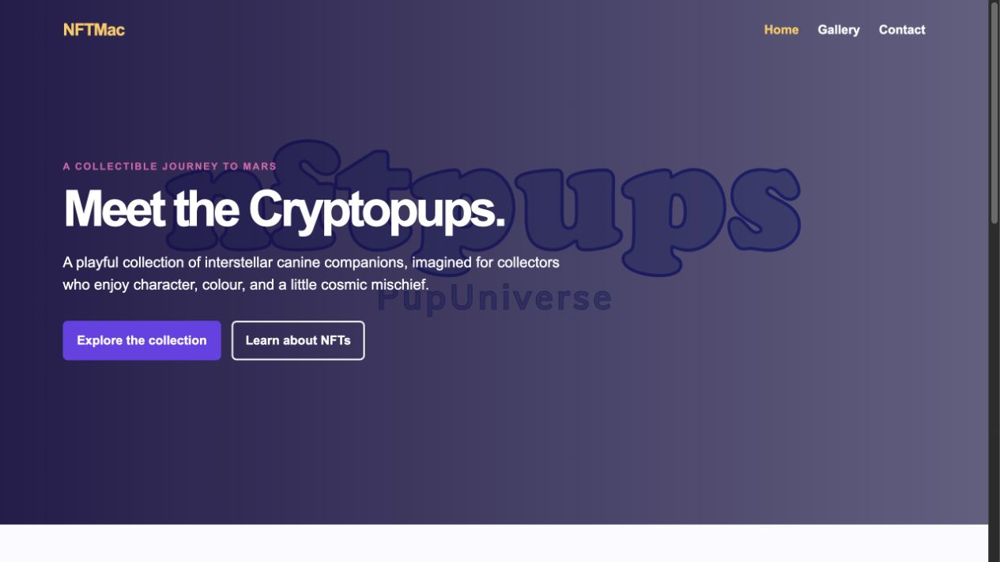
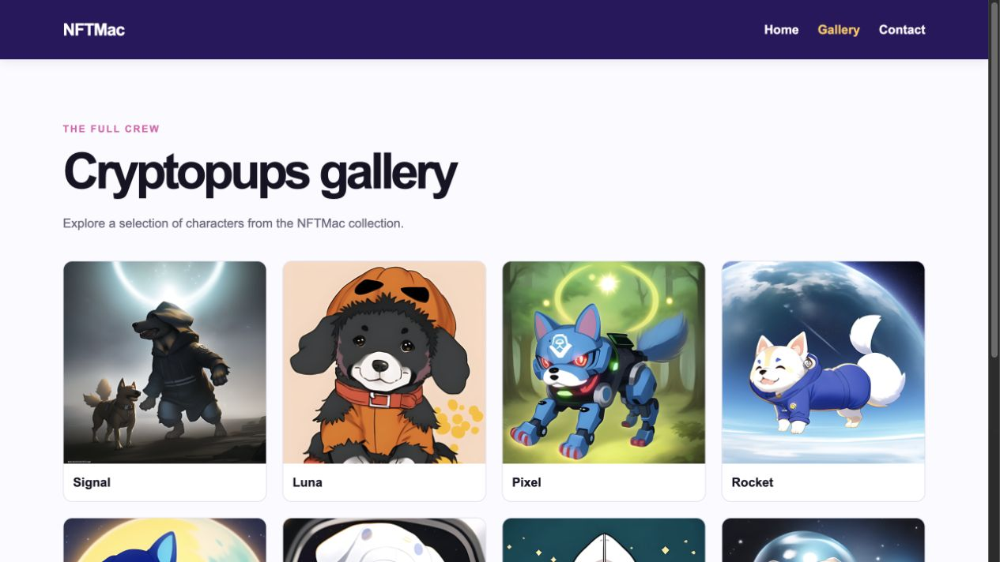
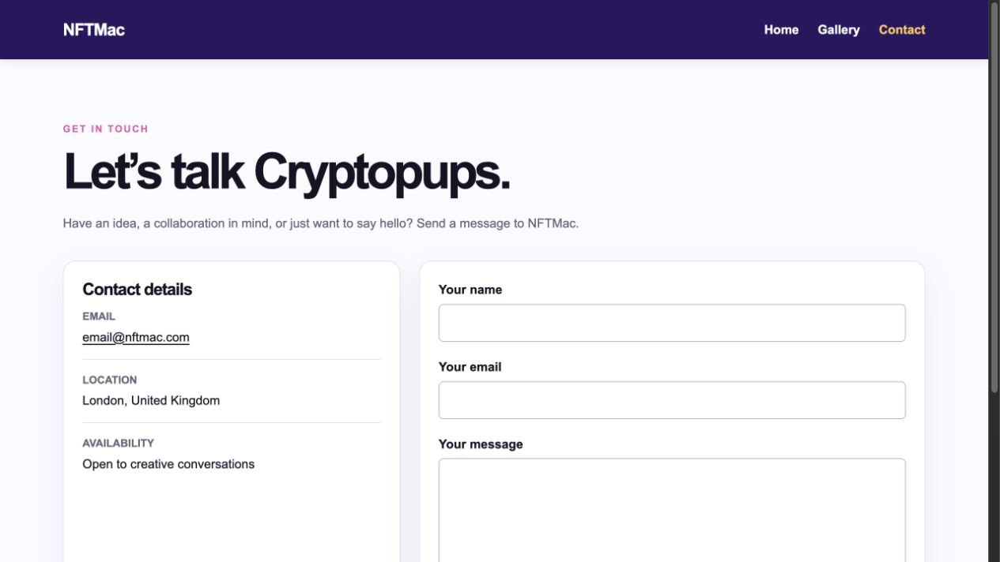

# NFTMac | The Cryptopups’ journey to Mars

[View the live site](https://mcauleemaddison.github.io/NFTMac/)

NFTMac is a responsive, visual-first showcase for the fictional Cryptopups digital collectible series. It combines a cinematic introduction, character gallery, and contact route in a small, accessible static site.

## User stories and finished screens

### Discover the collection

As a visitor, I can quickly understand the Cryptopups concept and move directly to the collection.



### Explore the characters

As a collector, I can browse a clear gallery of Cryptopups and identify each featured character.



### Start a conversation

As a potential collaborator, I can find contact details and use a labelled contact form to prepare an email message.



## Structure

All static assets are grouped by file type under `assets/`:

```text
assets/
├── css/
│   └── style.css
├── images/
│   ├── cryptopups/
│   └── screenshots/
└── video/
    └── nftmac-hero.mp4
```

All website images, including the finished-product screenshots, are consolidated within `assets/images/`.

## Quality checks

- Each page uses semantic HTML5 landmarks, a skip link, descriptive image alternative text, labelled form fields, and responsive layouts.
- The HTML pages pass the official W3C Nu HTML Checker without errors.
- The custom stylesheet passes the W3C CSS Validator without errors.
- Every external website link uses `target="_blank"` and `rel="noopener noreferrer"` so it opens safely in a separate tab.
- Homepage, gallery, navigation, and contact-form layouts were checked at desktop and mobile widths.

## Technologies

- HTML5
- CSS3
- Git and GitHub Pages

## Deployment

The site is deployed from the `main` branch through GitHub Pages:

https://mcauleemaddison.github.io/NFTMac/
